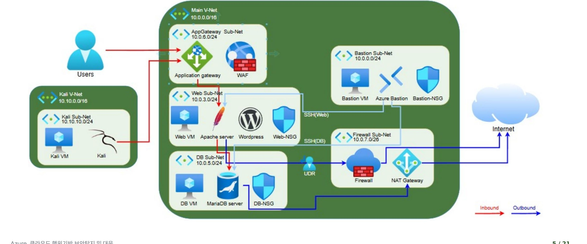

# 🛡️ Azure 클라우드 행위기반 보안탐지 및 대응

> Terraform 기반 로그 수집(AMA·DCR) · Sentinel 분석 규칙(KQL) 탐지 · SOAR 자동 대응 — 킬체인 전 과정 탐지·대응 체계 구축


---

## 📌 프로젝트 개요

Azure 환경에서 발생하는 **공격 행위를 로그 기반으로 탐지·대응하는 체계**를 구축한 프로젝트입니다. 외부 공격자가 웹 서버를 거점으로 내부 DB에 침투하여 개인정보를 유출하는 **킬체인(Kill Chain)**을 대상으로, **로그 수집 → Sentinel 탐지 → SOAR 자동 대응**의 전 과정을 설계·구현·검증하였습니다.

| 항목 | 내용 |
| --- | --- |
| 기간 | 2026.06.09 ~ 2026.07.01 |
| 팀 | 2조 (4인) |
| IaC 도구 | Terraform (azurerm 4.x) |
| 리전 | Korea Central |
| 로그 수집 | Azure Monitor Agent (AMA) · Data Collection Rule (DCR) |
| SIEM / 탐지 | Microsoft Sentinel · Defender for Cloud |
| 자동 대응 | Logic App 기반 SOAR Playbook (NSG 자동 차단) |
| 공격 환경 | Kali VM (별도 VNet, Peering 없음 → 외부 공격자 시뮬레이션) |
| 보안 도메인 | 로그 수집 · 위협 탐지 · 인시던트 조사 · 자동 대응 |

---

## 📐 아키텍처 개요

Azure Virtual Network(VNet) 기반으로 역할별 서브넷을 분리하고, 외부 공격자(Kali)는 피어링 없는 별도 VNet에 배치하여 외부 위협을 재현하였습니다. 웹 계층(AppGateway·WAF)·관리 계층(Bastion)·데이터 계층(DB Sub-Net)을 분리하고, Firewall·NAT Gateway로 아웃바운드를 통제합니다.



### 킬체인 6단계 및 탐지 근거

외부 공격자(Kali)가 웹 서버를 거점으로 내부 DB에 침투하여 개인정보(`personal_info`)를 유출하는 **킬체인 6단계**를 재현하고, 각 단계의 공격 행위를 로그로 수집하여 분석 규칙으로 탐지합니다.

| 단계 | 공격 행위 | 탐지 근거 (로그 출처) |
| --- | --- | --- |
| ① 외부 정찰 | 포트 스캔 (nmap) | Flow Log · Syslog |
| ② 초기 침입 | SSH 무차별 대입 | authpriv 인증 실패 |
| ③ 내부 이동 | DB 접근 시도 | local6 · FAILED CONNECT |
| ④ 데이터 수집 | `personal_info` 조회 | local6 감사 로그 |
| ⑤ 권한 상승 | 계정 생성 시도 | local6 권한 변경 |
| ⑥ 데이터 유출 | mysqldump 추출 | SQL_NO_CACHE 패턴 |

> 킬체인 흐름과 더불어 외부 웹 공격(SQLi·스캐너), WAF·Firewall 차단 시도, Key Vault·스토리지 접근 및 RBAC·정책·NSG 거버넌스 변경까지 각 지점을 별도 분석 규칙으로 탐지하여 단계별 탐지를 보강하였습니다.

---

## 🔧 환경 구성 (IaC)

전체 인프라를 **Terraform으로 코드화**하여 재현 가능하고 버전 관리되는 형태로 구성하였습니다. 기능별 파일 분리·모듈화로 개별 통제를 독립 배포·검증하고, 단일 `apply`로 통합 환경을 배포합니다.

### 파일 번호 체계

| 번호대 | 구성 요소 |
| --- | --- |
| `00 ~ 09` | 공통 인프라 — Provider · 네트워크 · NSG · VM · 모니터링 |
| `10 ~ 26` | 보호 통제 및 로그 확장 — Key Vault · 암호화 · RBAC · Policy · Defender |
| `30 ~ 40` | 행위 탐지 · 대응 — Sentinel 분석 규칙 · SOAR Playbook |

### 네트워크 설계

역할별 서브넷 분리를 원칙으로 설계하였습니다. WAF·Firewall은 전용 서브넷을 확보하고, DB는 사설 IP로만 운영합니다. 공격자(Kali)는 피어링 없는 별도 VNet에 배치하여 외부 공격 환경을 재현하였습니다.

| 구분 | 대역 | 용도 |
| --- | --- | --- |
| 메인 VNet | `10.0.0.0/16` | 운영 네트워크 |
| bastion 서브넷 | `10.0.0.0/24` | 관리 접속 (점프박스) |
| web 서브넷 | `10.0.3.0/24` | 웹 서버 (공인 IP) |
| db 서브넷 | `10.0.5.0/24` | DB 서버 (사설 IP) |
| AppGateway 서브넷 | `10.0.6.0/24` | WAF 전용 |
| Firewall 서브넷 | `10.0.7.0/26` | Azure Firewall 전용 |
| Kali VNet | `10.10.0.0/16` | 외부 공격자 (피어링 없음) |

---

## 📥 로그 수집 체계

공격 행위를 탐지하기 위해 모든 관련 로그를 중앙에 수집합니다. 각 VM의 시스템 로그와 DB 감사 로그를 **Azure Monitor Agent(AMA)**로 수집하여 Log Analytics로 전달하고, Sentinel이 통합 분석합니다.

```
VM 로그 ──▶ AMA ──▶ DCR ──▶ Log Analytics ──▶ Sentinel
(syslog·        (Azure     (Data       (team602-law)    (분석 규칙 탐지)
 MariaDB audit)  Monitor    Collection
                 Agent)     Rule)
```

| 로그 | Facility | 수집 내용 |
| --- | --- | --- |
| SSH 인증 로그 | `authpriv` | 로그인 성공·실패, 무차별 대입 |
| MariaDB 감사 로그 | `local6` | 접속·쿼리·권한 변경·데이터 조회 |
| Apache 접근 로그 | `local5` | 웹 스캐너·인젝션 요청 |
| 네트워크 트래픽 | Flow Log | 포트 스캔, 횡적 이동 |

추가로 **VNet Flow Log**로 네트워크 계층 행위를 가시화하고, **Defender for Cloud 로그**를 연속 내보내기로 Log Analytics에 스트리밍하여 보안 권장사항·경고·점수를 통합 수집합니다.

---

## 🔍 탐지 체계 (분석 규칙 11종)

공격 행위를 자동 탐지하는 **예약 분석 규칙 11종**을 Terraform(IaC)으로 정의하였습니다. 각 규칙은 `azurerm_sentinel_alert_rule_scheduled` 리소스로 코드화되며, 5분 주기로 실행되어 조건 충족 시 인시던트를 자동 생성합니다.

| 규칙 | 심각도 | 탐지 대상 | 데이터 출처 |
| --- | --- | --- | --- |
| SSH Brute Force 탐지 | Medium | 동일 IP의 SSH 로그인 실패 다수 | authpriv |
| 민감정보 테이블 접근/유출 탐지 | High | `personal_info` 조회·덤프 | local6 |
| DB 권한 변경/계정 생성 시도 탐지 | High | CREATE USER · GRANT 등 | local6 |
| 웹 공격 도구/스캐너 탐지 | Medium | nikto·sqlmap·wpscan User-Agent | local5 (Apache) |
| 웹 인젝션(SQLi/XSS) 시도 탐지 | High | UNION SELECT · OR 1=1 · script | local5 (Apache) |
| WAF 웹 공격 차단 탐지 | High | Application Gateway WAF Blocked | AzureDiagnostics |
| Firewall 아웃바운드 차단 탐지 | High | Azure Firewall 아웃바운드 Deny | AzureDiagnostics |
| Key Vault 비정상 접근 탐지 | High | 대량 시크릿 조회 | AzureDiagnostics |
| 스토리지 비인가 접근 탐지 | High | 인증 실패·비인가 접근 | StorageBlobLogs |
| 거버넌스 변경 탐지 | High | RBAC·정책·NSG 변경 | AzureActivity |
| Defender 경고 연동 탐지 | High | Defender for Cloud 경고 | SecurityAlert |

### KQL 예시 — SSH 무차별 대입 탐지

```kql
Syslog
| where ProcessName == "sshd"
| where SyslogMessage has_any ("Failed password", "Invalid user")
| summarize FailCount = count() by AttackerIP
| where FailCount > 10
```

### KQL 예시 — 민감정보 접근 탐지

```kql
Syslog
| where Facility == "local6"
| where SyslogMessage has "personal_info"
| where SyslogMessage has_any ("SELECT", "SQL_NO_CACHE")
| summarize AccessCount = count()
```

---

## 🤖 SOAR 자동 대응

탐지된 공격에 대해 **사람의 개입 없이 자동 대응**하는 SOAR 체계를 구성하였습니다. Logic App 기반 Playbook이 Sentinel 인시던트를 입력받아 공격자 IP를 추출하고 NSG에 차단 규칙을 자동 생성합니다.

```
트리거 ──▶ IP 추출 ──▶ 반복(For each) ──▶ 차단
(Sentinel   (엔터티에서    (추출 IP           (web-nsg Deny
 인시던트     공격자 IP       목록 순회)          규칙 자동 생성)
 생성)        획득)
```

- **Playbook** — Consumption 요금제 Logic App, 트리거 1개 + 액션 3개 구성 (Korea Central)
- **NSG 차단 규칙** — `securityRules/Block-Attacker` 생성, priority 200 · Deny · Inbound, 공격자 IP 동적 주입
- **검증** — 실제 공격자 IP(Kali)를 대상으로 Playbook 실행 → web-nsg에 차단 규칙 자동 등록 확인
- **코드화** — 전체 Playbook 정의를 Terraform으로 코드화 (API 연결 재인증 + 1회 게시 후 정상 동작)

---

## ✅ 핵심 성과

외부 공격자의 침투부터 개인정보 유출까지의 공격을 수행하고, 각 단계가 로그로 수집되어 Sentinel에서 탐지·인시던트화되며 SOAR로 자동 대응되는 **완결적 보안 운영 체계**를 검증하였습니다.

| 영역 | 핵심 성과 |
| --- | --- |
| 🔷 로그 수집 | 시스템·DB 감사 로그 중앙 수집 · VNet Flow Log 가시성 확장 |
| 🔷 탐지 | 분석 규칙 11종 KQL·IaC 구성 · 킬체인/인프라 계층 위협 포괄 |
| 🔷 검증 | 킬체인 각 단계 탐지·인시던트화 · 거부 시도도 IoC로 기록 확인 |
| 🔷 자동화 | SOAR Playbook 자동 차단 구현 · 조사·대응 절차 체계화 |

> 보안 통제가 없는 무방비 환경에서도 모든 공격이 탐지·기록됨을 확인하였으며, 탐지 결과에 대한 자동 대응까지 **로그 수집 → 탐지 → 조사 → 자동 대응**의 전 과정을 검증하였습니다.

---

## 📂 디렉터리 구조

```
azure-behavior-detection-portfolio/
├── README.md
├── diagrams/                       # 아키텍처 구성도
│   └── architecture.jpg
├── terraform/                      # 탐지·대응 IaC (분석 규칙 · SOAR)
│   ├── 30_sentinel_rules.tf        # Sentinel 예약 분석 규칙
│   ├── 31_web_attack_rule.tf       # 웹 공격/스캐너 탐지
│   ├── 32_waf_attack_rule.tf       # WAF 차단 탐지
│   ├── 33_firewall_exfil_rule.tf   # Firewall 아웃바운드 차단 탐지
│   ├── 34_keyvault_access_rule.tf  # Key Vault 비정상 접근 탐지
│   ├── 35_storage_access_rule.tf   # 스토리지 비인가 접근 탐지
│   ├── 36_governance_change_rule.tf# 거버넌스 변경 탐지
│   ├── 37_defender_alert_rule.tf   # Defender 경고 연동 탐지
│   └── 40_soar_playbook.tf         # SOAR Playbook (NSG 자동 차단)
└── docs/                           # 산출물
    ├── team602_행위기반_보안탐지_및_대응_보고서.docx
    └── team602_행위기반_보안탐지_및_대응_발표.pptx
```

---

## 🧰 기술 스택

`Azure` · `Terraform` · `Microsoft Sentinel` · `Defender for Cloud` · `Log Analytics` · `Azure Monitor Agent` · `Logic App (SOAR)` · `KQL` · `NSG` · `Key Vault` · `Azure Firewall` · `Application Gateway (WAF)`
