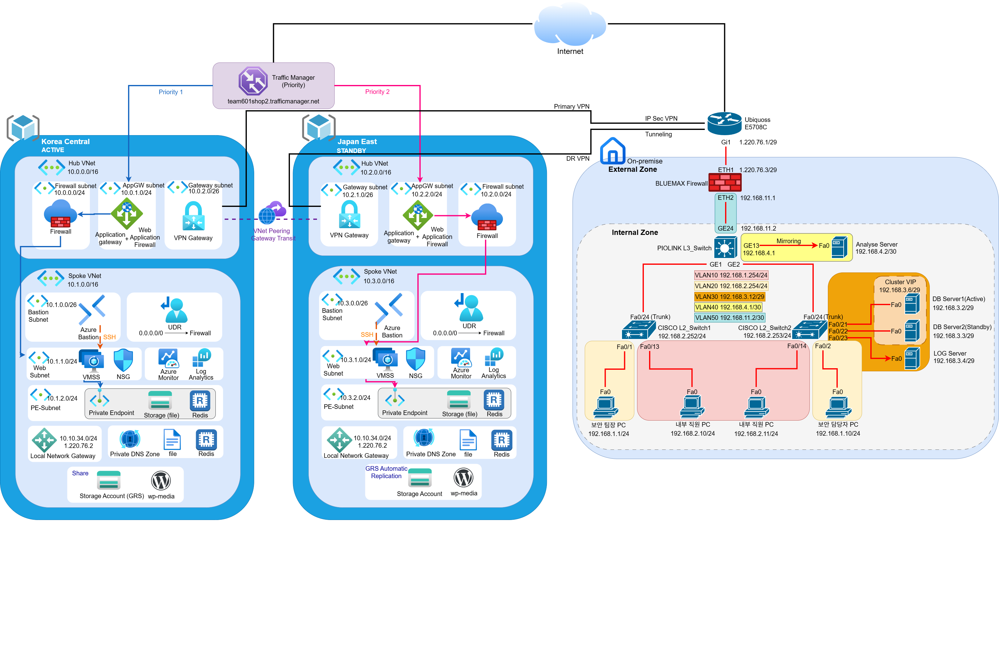

# ☁️ Azure 클라우드 인프라 및 M365 Defender 보안구축

> **Terraform 기반 Azure Hub-Spoke 아키텍처 · 다중 리전 DR · 하이브리드 VPN 연동**


---

## 📌 프로젝트 개요

온프레미스 환경에서 운영되던 웹 서비스를 Azure 퍼블릭 클라우드로 확장·이관하여,  
**무중단 고가용성과 재해복구(DR) 역량을 갖춘 하이브리드 클라우드 인프라**를 구축한 프로젝트입니다.

| 항목 | 내용 |
|------|------|
| 기간 | 2026.05.13 ~ 2026.05.19 |
| 팀 | 1조  |
| IaC 도구 | Terraform (azurerm 4.74.0) |
| 주 리전 | Korea Central (Active) |
| DR 리전 | Japan East (Standby) |
| 웹 서비스 | WordPress 7.0 + WooCommerce 쇼핑몰 |
| DB | 온프레미스 MySQL (IPsec VPN 연동) |

---

## 🏗️ 아키텍처 개요

### 최종 구성도 (5단계)



### 단계별 확장 전략

| 단계 | 핵심 구성 | 목표 |
|------|-----------|------|
| 1단계 | VNet, AppGW, VMSS, Bastion, Storage | 단일 리전 기본 웹 서비스 |
| 2단계 | Hub-Spoke 망 분리, VNet Peering | 네트워크 격리 및 확장성 |
| 3단계 | VMSS 자동 확장, WAF, Redis, Private Endpoint, Monitor | 서비스 계층 강화 |
| 4단계 | Japan East 추가, Azure Firewall, UDR, IPsec VPN | 다중 리전 DR · 하이브리드 연동 |
| 5단계 | Traffic Manager, Azure Files, 통합 모니터링 | 자동 절체 · 성능 최적화 |

<details>
<summary>📸 단계별 구성도 보기</summary>

**1단계 — 단일 리전 기본 인프라**


**2단계 — Hub-Spoke 망 분리**


**3단계 — 보안 계층 강화**


**4단계 — 다중 리전 DR 및 하이브리드 VPN**


**5단계 — 성능 및 운영 최적화**


</details>

---

## ⚙️ 기술 스택

### 인프라 & 네트워킹
| 기술 | 용도 |
|------|------|
| **Azure VNet (Hub-Spoke)** | Hub에 공유 서비스, Spoke에 워크로드 격리 |
| **Azure Firewall** | 중앙 집중식 아웃바운드 트래픽 제어, UDR 강제 경유 |
| **Application Gateway + WAF** | L7 로드밸런싱 · SQL Injection 등 웹 공격 차단 |
| **VPN Gateway** | Site-to-Site IPsec 터널 (IKEv2, AES-256-SHA-256) |
| **Traffic Manager** | 우선순위 라우팅 기반 리전 간 자동 페일오버 |
| **NSG** | 서브넷/NIC 단위 인바운드·아웃바운드 방화벽 |
| **Azure Bastion** | 공인 IP 없이 VM 안전 접속 |

### 컴퓨팅 & 데이터
| 기술 | 용도 |
|------|------|
| **VMSS** | 자동 확장, Zone 분산, cloud-init 초기화 |
| **Azure Managed Redis** | Private Endpoint 격리, WordPress 세션·캐시 |
| **Azure Files** | VMSS 인스턴스 간 공유 미디어 스토리지 |
| **Storage Account (GRS/LRS)** | 미디어 파일 저장, 리전 간 복제 |
| **Private Endpoint** | PaaS 서비스 공인 노출 차단, 사설 IP 연결 |

### 웹 서비스
| 기술 | 용도 |
|------|------|
| **WordPress 7.0 (ko_KR)** | WooCommerce 기반 쇼핑몰 |
| **Rocky Linux 9** | VMSS 운영체제 |
| **Apache + PHP** | 웹 서버 스택 |
| **Custom auth.php** | 온프레미스 MySQL 직접 연동 PHP 인증 시스템 |

### IaC & 모니터링
| 기술 | 용도 |
|------|------|
| **Terraform** | 전체 인프라 코드화 (선언형 프로비저닝) |
| **Log Analytics + Azure Monitor** | 전체 리소스 로그 중앙 수집 · 알람 |

---

## 🌐 네트워크 설계

### VNet 및 서브넷 대역

| 리전 | VNet | 대역 | 주요 서브넷 |
|------|------|------|-------------|
| Korea Central | central-hub-vnet | 10.0.0.0/16 | AzureFirewallSubnet, AppGW-Subnet, GatewaySubnet |
| Korea Central | central-spoke-vnet | 10.1.0.0/16 | AzureBastionSubnet, Web-Subnet, PE-Subnet |
| Japan East | japan-hub-vnet | 10.2.0.0/16 | AzureFirewallSubnet, AppGW-Subnet, GatewaySubnet |
| Japan East | japan-spoke-vnet | 10.3.0.0/16 | AzureBastionSubnet, Web-Subnet, PE-Subnet |
| 온프레미스 | Bluemax NGF 100 | 10.10.34.0/24 | MySQL 서버 (10.10.34.119) |

### VPN 연결 (하이브리드)

```
온프레미스 (Bluemax 방화벽)  ──IPsec VPN──  Azure VPN Gateway
  10.10.34.0/24                              (Korea Central / Japan East)
  IKEv2 · AES-256-SHA-256                   IKE SA 28800s / IPsec SA 27000s
```

---

## 🛡️ 보안 검증 결과

| 검증 항목 | 결과 |
|-----------|------|
| VMSS 공인 IP 제거 (인터넷 직접 노출 차단) | ✅ |
| Azure Firewall 아웃바운드 강제 경유 (UDR) | ✅ |
| WAF SQL Injection 차단 (403 응답) | ✅ |
| Redis / Storage Private Endpoint (공용 액세스 Disabled) | ✅ |
| Private DNS → 사설 IP 반환 확인 | ✅ |
| Bastion 통한 안전한 VM 접속 | ✅ |

---

## 📈 고가용성 및 DR 검증

| 검증 항목 | 결과 |
|-----------|------|
| VMSS 인스턴스 1대 중지 후 서비스 지속 | ✅ |
| CPU 부하 → 인스턴스 자동 증가 (Auto Scale) | ✅ |
| Traffic Manager → Japan East 자동 페일오버 | ✅ |
| Central VPN / Japan VPN 양방향 입출력 확인 | ✅ |

---

## 📁 디렉터리 구조

```
azure-cloud-portfolio/
│
├── README.md                      ← 이 파일
│
├── terraform/                     ← 전체 Terraform 코드 (IaC)
│   ├── 00_init.tf                 # Provider 초기화
│   ├── 01_rg.tf                   # 리소스 그룹
│   ├── 02_vnet.tf                 # 가상 네트워크
│   ├── 03_sub.tf                  # 서브넷
│   ├── 04_pubip.tf                # 공인 IP
│   ├── 05_appgw.tf                # Application Gateway + WAF
│   ├── 06_bastion.tf              # Azure Bastion
│   ├── 07_nsg.tf                  # NSG 규칙
│   ├── 08_nsgsub.tf               # NSG-서브넷 연결
│   ├── 09_peering.tf              # VNet Peering
│   ├── 10_firewall.tf             # Azure Firewall + Policy
│   ├── 11_udr.tf                  # UDR 사용자 라우팅
│   ├── 12_vpngw.tf                # VPN Gateway
│   ├── 13_localnetgw.tf           # 로컬 네트워크 게이트웨이
│   ├── 14_vpnconn.tf              # IPsec VPN 연결
│   ├── 15_storage.tf              # Storage + Azure Files + PE
│   ├── 16_redis.tf                # Azure Managed Redis + PE
│   ├── 17_vmss.tf                 # VMSS + cloud-init
│   ├── 18_auto.tf                 # Auto Scale 정책
│   ├── 19_monitor.tf              # Log Analytics + 진단
│   ├── 20_trafficmanager.tf       # Traffic Manager
│   └── 100_var.tf                 # 전역 변수
│
├── diagrams/                      ← 아키텍처 구성도
│   ├── phase1_final.png           # 1단계 구성도
│   ├── phase2_final.png           # 2단계 구성도
│   ├── phase3_final.png           # 3단계 구성도
│   ├── phase4_final.png           # 4단계 구성도
│   ├── phase5_final.png           # 5단계 구성도
│   ├── 구성도1_.png               # 구성도 (버전 1)
│   ├── 구성도3_.png               # 구성도 (버전 3)
│   ├── 구성도4_.png               # 구성도 (버전 4)
│   ├── 구성도5__drawio.png        # 최종 구성도
│   ├── team601centralrg2_1.png    # Korea Central 리소스 그룹
│   └── team601japanrg2_1.png      # Japan East 리소스 그룹
│
└── docs/                          ← 문서
    ├── 1조_Azure_클라우드_인프라_및_M365_Defender_보안구축.docx  ← 최종 보고서
    └── 1팀_Azure_클라우드_인프라_및_M365_Defender_보안_구축.pptx ← 발표 자료
```

---

## 🚀 Terraform 사용법

```bash
# 1. 변수 파일 생성 (⚠️ 실제 값 입력 필요)
cp terraform.tfvars.example terraform.tfvars
# vpn_psk 등 민감 정보는 환경변수로 관리 권장:
# export TF_VAR_vpn_psk="your-psk-here"

# 2. 초기화
cd terraform
terraform init

# 3. 계획 확인
terraform plan

# 4. 배포
terraform apply
```

> ⚠️ **주의**: `100_var.tf`의 `vpn_psk` 기본값은 **반드시 변경**하세요.  
> 민감 정보는 `terraform.tfvars` (`.gitignore` 등록) 또는 환경변수로 관리하는 것을 권장합니다
--

## 📚 참고 자료

- [Microsoft Azure 공식 문서](https://learn.microsoft.com/ko-kr/)
- [Terraform AzureRM Provider](https://registry.terraform.io/providers/hashicorp/azurerm/latest/docs)
- [Diagrams.net (구성도 작성)](https://app.diagrams.net/)
