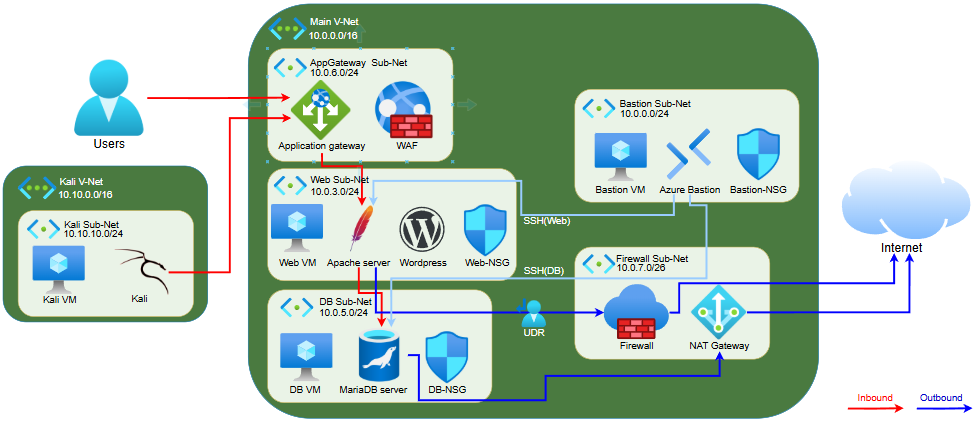

# 🛡️ Azure 클라우드 데이터 및 App 보안

> **Terraform 기반 심층 방어(Defense in Depth) 아키텍처 · Before/After 공격 검증 · Sentinel SOAR 자동 대응**


---

## 📌 프로젝트 개요

인터넷에 노출된 웹 서비스와 내부 데이터베이스 환경에 대해, **심층 방어 원칙에 따라 계층별 보안 통제를 코드(IaC)로 설계·구현**하고,
무방비 상태(Before)에서 공격이 도달함을 확인한 뒤 통제 적용(After)으로 차단·완화됨을 검증한 프로젝트입니다.

| 항목 | 내용 |
|------|------|
| 기간 | 2026.05.20 ~ 2026.06.08 |
| 팀 | 2조 (4인) |
| IaC 도구 | Terraform (azurerm 4.x) |
| 리전 | Korea Central |
| 웹 서비스 | WordPress 기반 쇼핑몰 "Lupang" (Apache + PHP) |
| DB | VM 내부 MariaDB (개인정보 테이블 포함, audit 로그 활성화) |
| 공격 환경 | Kali VM (별도 VNet, Peering 없음 → 외부 공격자 시뮬레이션) |
| 보안 도메인 | IAM · 플랫폼 보호 · 데이터 보호 · 보안 운영(탐지/대응) |

---

## 🏗️ 아키텍처 개요

### 전체 구성도



### 심층 방어 계층 구성

| 계층 | 적용 통제 | 목표 |
|------|-----------|------|
| 네트워크 경계 | NSG, NAT Gateway, Azure Firewall(UDR), VNet Flow Log | 인바운드 차단 · 아웃바운드 통제 · 트래픽 가시성 |
| 애플리케이션 | Application Gateway + WAF | SQL Injection 등 웹 공격 차단 |
| 호스트 | JIT VM Access, Defender for Servers(EDR) | 관리 포트 상시 차단 · 엔드포인트 위협 탐지 |
| 데이터 | Key Vault, Disk Encryption Set(CMK), Storage 보안, Managed Identity | 자격증명 외부화 · 저장 데이터 암호화 |
| ID · 거버넌스 | 커스텀 RBAC, Azure Policy, 표준 태깅, 변경 탐지 | 최소 권한 · 배포 제어 · 변경 가시성 |
| 탐지 · 대응 | Log Analytics, Sentinel 분석 규칙 7종, SOAR Playbook | 공격 탐지 → 인시던트 → 자동 차단 |

---

## 🚨 공격 탐지 → 자동 대응 (SOAR)

| 단계 | 동작 |
|------|------|
| 1 | Kali VM이 Web/DB 공격 실행 (SSH brute force, 개인정보 테이블 조회) |
| 2 | VM 내부 rsyslog가 로그 기록 (SSH → authpriv, MariaDB audit → local6) |
| 3 | AMA가 DCR 규칙대로 선별하여 Log Analytics로 전송 |
| 4 | Sentinel 분석 규칙이 5분 주기로 쿼리 → 매칭 시 Alert → Incident 생성 (공격자 IP를 Entity로 첨부) |
| 5 | SOAR Playbook이 인시던트 수신 → Entity에서 IP 추출 → ARM API로 web-nsg에 Deny 규칙 생성 |
| 6 | 이후 해당 공격자 IP의 접근 차단 |

---

## ⚙️ 기술 스택

### 인프라 & 네트워킹
| 기술 | 용도 |
|------|------|
| **Azure VNet (이중 VNet)** | 서비스 VNet과 공격자(Kali) VNet 분리, Peering 미구성으로 외부 공격 재현 |
| **NSG** | 서브넷 단위 인바운드·아웃바운드 방화벽, Before/After 차단 검증 |
| **Azure Firewall + UDR** | 웹 서브넷 아웃바운드 강제 경유, 데이터 유출 통제 |
| **Application Gateway + WAF** | L7 보호, SQL Injection 등 웹 공격 차단 |
| **NAT Gateway** | DB 서브넷 아웃바운드 전용 경로 (공인 IP 미노출) |
| **VNet Flow Log** | 네트워크 레벨 허용/거부 트래픽 검증 |

### IAM & 거버넌스
| 기술 | 용도 |
|------|------|
| **커스텀 RBAC 역할 3종** | vm-operator · monitoring-reader · network-operator 직무 분리 |
| **Azure Policy** | 필수 태그 강제, 허용 리전 제한 |
| **Managed Identity** | VM → Key Vault 자격증명 없는 접근 |
| **App Registration (Service Principal)** | Azure 외부 스크립트용 최소 권한 신원 |
| **활동 로그 변경 탐지** | NSG 등 거버넌스 변경 시 경고 → 이메일 알림 |

### 데이터 보호
| 기술 | 용도 |
|------|------|
| **Key Vault** | DB 자격증명 외부화 (코드 내 평문 제거) |
| **Disk Encryption Set (CMK)** | 고객 관리 키 기반 VM OS 디스크 암호화 |
| **Storage 보안 · 진단** | 공용 액세스 차단, HTTPS 강제, 접근 로그 수집 |
| **Key Vault 진단 로그** | SecretGet/Set/Delete 접근 감사 |

### 위협 탐지 & 대응
| 기술 | 용도 |
|------|------|
| **Defender for Cloud** | 서버·스토리지·Key Vault 워크로드 보호, 권장사항 자동 탐지 |
| **Defender for Endpoint (EDR)** | VM 온보딩, 보안 경고 탐지 |
| **JIT VM Access** | 관리 포트(SSH) 상시 차단 → 요청 시 시간제한 오픈, NSG 규칙 자동 변화 |
| **Continuous Export** | Defender 권장사항·경고를 Log Analytics로 지속 내보내기 |
| **Microsoft Sentinel** | 분석 규칙 7종 (SSH brute force · 웹 공격 · WAF · Firewall 유출 · KV/Storage 접근 · 거버넌스 변경 · Defender 경고) |
| **SOAR Playbook (Logic App)** | 인시던트 → 공격자 IP NSG 자동 차단 |

### IaC & 웹 서비스
| 기술 | 용도 |
|------|------|
| **Terraform** | 전체 인프라·보안 통제 코드화, 하나의 apply로 배포되는 통합 모듈 |
| **cloud-init 템플릿** | Web/DB/Bastion/Kali VM 초기화 자동화 |
| **Rocky Linux 9** | 전 VM 운영체제 |
| **WordPress + MariaDB** | 공격 대상 쇼핑몰 및 개인정보 DB |

---

## 🌐 네트워크 설계

| VNet | 대역 | 서브넷 | 용도 |
|------|------|--------|------|
| team602-vnet | 10.0.0.0/16 | bastion (10.0.0.0/24) | 점프박스 (관리자 IP만 SSH 허용) |
| | | web (10.0.3.0/24) | WordPress 웹 서버 |
| | | db (10.0.5.0/24) | MariaDB (공인 IP 없음, NAT 아웃바운드) |
| | | AppGatewaySubnet (10.0.6.0/24) | WAF |
| | | AzureFirewallSubnet (10.0.7.0/26) | Azure Firewall |
| team602-kali-vnet | 10.10.0.0/16 | kali (10.10.10.0/24) | 공격자 시뮬레이션 (Peering 없음) |

---

## 🛡️ 보안 검증 결과 (Before / After)

| 검증 항목 | 결과 |
|-----------|------|
| NSG 적용 후 포트 스캔 트래픽 Allowed → Denied 전환 (Flow Log 검증) | ✅ |
| WAF 적용 후 SQL Injection 등 웹 공격 차단 (wpscan · nikto · sqlmap 진단 기반) | ✅ |
| Key Vault 자격증명 외부화 + SecretGet 접근 로그 수집 | ✅ |
| Managed Identity로 자격증명 없는 Key Vault 접근 | ✅ |
| Service Principal 최소 권한 검증 (Secret 읽기만 가능, 구독 접근 불가) | ✅ |
| CMK 기반 OS 디스크 암호화 (Disk Encryption Set) | ✅ |
| Defender for Cloud 권장사항 자동 탐지 (wp-config.php 평문 비밀번호 노출 탐지) | ✅ |
| Defender for Endpoint(EDR) 온보딩 및 보안 경고 탐지 | ✅ |
| JIT 적용 후 SSH 상시 차단 → 승인 시 시간제한 오픈 (NSG 규칙 자동 변화 확인) | ✅ |
| Continuous Export → Log Analytics 수집 (SecurityRecommendation 22건) | ✅ |
| Sentinel: SSH brute force 탐지 → Incident 생성 (공격자 IP Entity 첨부) | ✅ |
| SOAR Playbook: 공격자 IP NSG 자동 차단 (Block-Attacker Deny 규칙) | ✅ |
| RBAC·Policy 권한 보유 환경 재검증 / MFA·PIM 별도 테넌트 실물 검증 | ✅ |

---

## 🧩 제약 조건과 해결

| 제약 | 해결 |
|------|------|
| Defender Plan 1에서 JIT Terraform 리소스 미지원 (azurerm 4.x) | 포털/CLI 대체 검증 + Plan 2 개인 구독에서 Terraform 전체 워크플로 별도 검증 |
| Defender subscription-level 플랜 re-apply 충돌 | `import` 후 apply 패턴 + `lifecycle` 블록 적용 |
| Entra ID P1/P2 라이선스 부재 (MFA·PIM) | P2 평가판 조직 테넌트를 별도 구성하여 실물 검증 (신원 평면/리소스 평면 분리) |
| Purview DLP 테넌트 제약 | 설계 수준 기술 + 대체 통제(DB audit 로그 → Sentinel 탐지)로 보완 |
| Public IP 한도 3개 · 일부 VM SKU 미제공 | 한도 내 재설계 (NAT 공유, 대체 SKU) |

---

## 📁 디렉터리 구조

```
azure-data-app-security-portfolio/
│
├── README.md                        ← 이 파일
│
├── terraform/                       ← 전체 Terraform 코드 (IaC)
│   ├── 00_provider.tf               # Provider 초기화
│   ├── 01_variables.tf              # 전역 변수
│   ├── 02_rg.tf                     # 리소스 그룹
│   ├── 03_network.tf                # VNet 2개 + 서브넷 (서비스/Kali 분리)
│   ├── 04_nsg.tf                    # NSG 규칙 + 서브넷 연결
│   ├── 05_pubip.tf                  # 공인 IP
│   ├── 06_nat.tf                    # NAT Gateway (DB 아웃바운드)
│   ├── 07_nic.tf                    # 네트워크 인터페이스
│   ├── 08_vm.tf                     # VM 4대 (Web/DB/Bastion/Kali) + cloud-init
│   ├── 09_monitor.tf                # Log Analytics + AMA/DCR 로그 파이프라인
│   ├── 10_keyvault.tf               # Key Vault + DB 자격증명 Secret
│   ├── 11_managed_identity.tf       # VM Managed Identity → KV 접근 정책
│   ├── 12_disk_encryption.tf        # Disk Encryption Set (CMK)
│   ├── 13_kv_diagnostics.tf         # Key Vault 접근 로그 수집
│   ├── 14_storage_security.tf       # Storage 보안 강화
│   ├── 15_storage_diagnostics.tf    # Storage 접근 로그 수집
│   ├── 16_app_registration.tf       # Service Principal (외부 신원)
│   ├── 17_rbac.tf                   # 커스텀 RBAC 역할 3종
│   ├── 18_policy.tf                 # Azure Policy (태그 강제 · 리전 제한)
│   ├── 19_governance_detect.tf      # 거버넌스 변경 탐지 경고
│   ├── 20_defender.tf               # Defender for Cloud 플랜
│   ├── 21_jit.tf                    # JIT VM Access
│   ├── 22_defender_workspace.tf     # Defender ↔ Log Analytics 연동
│   ├── 23_waf.tf                    # Application Gateway + WAF
│   ├── 24_firewall.tf               # Azure Firewall + UDR
│   ├── 25_vnet_flowlog.tf           # VNet Flow Log
│   ├── 25_vnet_flowlog.tf.Watcher   # (대체 버전) NetworkWatcherRG 자동 생성 환경용
│   ├── 26_defender_export.tf        # Defender Continuous Export
│   ├── 30_sentinel_rules.tf         # Sentinel 온보딩 + SSH brute force 규칙
│   ├── 31_web_attack_rule.tf        # 웹 공격 탐지 규칙
│   ├── 32_waf_attack_rule.tf        # WAF 차단 이벤트 탐지 규칙
│   ├── 33_firewall_exfil_rule.tf    # Firewall 데이터 유출 탐지 규칙
│   ├── 34_keyvault_access_rule.tf   # Key Vault 이상 접근 탐지 규칙
│   ├── 35_storage_access_rule.tf    # Storage 이상 접근 탐지 규칙
│   ├── 36_governance_change_rule.tf # 거버넌스 변경 탐지 규칙
│   ├── 37_defender_alert_rule.tf    # Defender 경고 연동 규칙
│   ├── 40_soar_playbook.tf          # SOAR Playbook (공격자 IP 자동 차단)
│   ├── 99_outputs.tf                # 출력 값
│   ├── scripts/                     # cloud-init 템플릿 (web/db/bastion/kali)
│   └── terraform.tfvars.example    # 변수 예시 (실제 값은 커밋하지 않음)
│
└── diagrams/                        ← 아키텍처 구성도
    └── architecture_v2.png          # 전체 구성도
```

---

## 🚀 Terraform 사용법

```bash
# 1. 변수 파일 생성 (⚠️ 실제 값 입력 필요)
cd terraform
cp terraform.tfvars.example terraform.tfvars

# 2. VM 접속용 SSH 키를 terraform/ 디렉터리에 배치
ssh-keygen -t rsa -b 4096 -f id_rsa -N ""

# 3. 초기화
terraform init

# 4. 계획 확인
terraform plan

# 5. 배포
terraform apply
```

> ⚠️ **주의**: `terraform.tfvars`의 `admin_ip`는 본인 공인 IP로, DB 비밀번호는 강력한 값으로 **반드시 변경**하세요.
> 민감 정보 파일(`terraform.tfvars`, SSH 키)은 `.gitignore`에 등록되어 커밋되지 않습니다.
>
> 배포 계정에는 **Owner 또는 Contributor + User Access Administrator**(RBAC 할당), Defender 플랜 활성화용 **Security Admin** 역할이 필요합니다.

---

## 📚 참고 자료

- [Microsoft Azure 공식 문서](https://learn.microsoft.com/ko-kr/)
- [Terraform AzureRM Provider](https://registry.terraform.io/providers/hashicorp/azurerm/latest/docs)
- [Microsoft Sentinel 문서](https://learn.microsoft.com/ko-kr/azure/sentinel/)
- [Microsoft Defender for Cloud 문서](https://learn.microsoft.com/ko-kr/azure/defender-for-cloud/)
