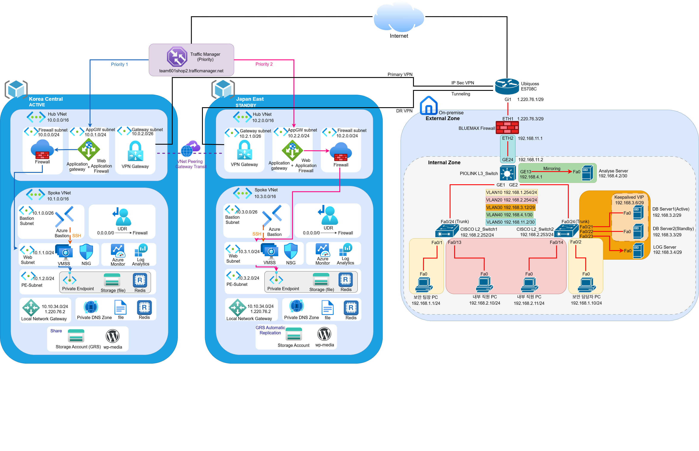

# 🔐 하이브리드 클라우드 보안구축

> **On-premise 인프라 구축 및 Azure Hybrid Cloud 전환**  
> 2026.07.02 ~ 2026.07.20 · team601

---

## 📌 프로젝트 개요

온프레미스 환경을 직접 구축한 뒤, 웹 서버를 Azure 퍼블릭 클라우드로 이전하는 **단계적 하이브리드 클라우드** 보안 인프라 구축 프로젝트입니다.  
이전 프로젝트에서 구축한 Azure 인프라(VMSS · WAF · Firewall)를 연계하여 하이브리드 구조를 완성하였습니다.

---

## 🏗️ 인프라 구성도



---

## 🌐 네트워크 설계

```
[인터넷]
    │
[SECUI Bluemax NGF 100] — 방화벽 (WAN: 1.220.76.2/29)
    │
[PIOLINK TiFRONT G24] — L3 스위치
    ├── GE1  → CISCO Catalyst 2960 L2-1 (VLAN10/20)
    ├── GE2  → CISCO Catalyst 2960 L2-2 (VLAN10/20/30)
    ├── GE13 → Analyse 서버 (포트 미러링)
    └── GE24 → 방화벽 연결

VLAN 10  192.168.1.0/24   보안담당자 (관리)
VLAN 20  192.168.2.0/24   내부 직원
VLAN 30  192.168.3.0/29   서버팜
  ├── DB1  192.168.3.2  Active
  ├── DB2  192.168.3.3  Standby
  ├── LOG  192.168.3.4
  └── VIP  192.168.3.6  (keepalived)
VLAN 40  192.168.4.0/30   Analyse 서버 (192.168.4.2)
```

```
Traffic Manager (team601shop.trafficmanager.net)
    ├── Korea Central [Active]   AppGW 20.214.152.240
    │   ├── Hub VNet 10.0.0.0/16  (Firewall · AppGW · VPN GW)
    │   └── Spoke VNet 10.1.0.0/16  (VMSS · Redis · Storage PE)
    └── Japan East [Standby/DR]  AppGW 52.140.213.49
        ├── Hub VNet 10.2.0.0/16
        └── Spoke VNet 10.3.0.0/16

IPsec VPN  AES-256 / SHA-256 / DHGroup14 / IKEv2
    Azure VPN GW ↔ Bluemax NGF 100 (1.220.76.2)
    → On-premise MySQL VIP (192.168.3.6:3306) 연동
```

---

## 🛠️ 기술 스택

| 구분 | 기술 |
|------|------|
| 방화벽 | SECUI Bluemax NGF 100 |
| 스위치 | PIOLINK TiFRONT G24 (L3), CISCO Catalyst 2960 (L2) × 2 |
| DB | MySQL 8.0 Master-Master + keepalived VIP |
| Log | rsyslog + RAID1 |
| 트래픽 분석 | Wireshark / tshark |
| OS | Rocky Linux 9 |
| IaC | Terraform (azurerm 4.74.0) |
| 웹 | VMSS + Application Gateway WAF_v2 (OWASP 3.2) |
| 보안 | Azure Firewall, NSG, UDR, Private Endpoint |
| DR | Traffic Manager (우선순위 라우팅) |
| 모니터링 | Log Analytics Workspace |

---

## 📁 디렉터리 구조

```
📦 hybrid-cloud-security
 ├── 📄 README.md
 ├── 📂 images/
 │   └── architecture.png
 ├── 📂 terraform/
 │   ├── 00_init.tf            # Provider 초기화 (azurerm 4.74.0)
 │   ├── 01_rg.tf              # 리소스 그룹 (Central · Japan)
 │   ├── 02_vnet.tf            # 가상 네트워크 Hub/Spoke × 2 리전
 │   ├── 03_sub.tf             # 서브넷
 │   ├── 04_pubip.tf           # 공인 IP
 │   ├── 05_appgw.tf           # Application Gateway + WAF
 │   ├── 06_bastion.tf         # Bastion
 │   ├── 07_nsg.tf             # NSG 규칙
 │   ├── 08_nsgsub.tf          # NSG 연결
 │   ├── 09_peering.tf         # VNet Peering (Hub ↔ Spoke)
 │   ├── 10_firewall.tf        # Azure Firewall + 정책
 │   ├── 11_udr.tf             # UDR (Firewall 강제 경유)
 │   ├── 12_vpngw.tf           # VPN Gateway (VpnGw1AZ)
 │   ├── 13_localnetgw.tf      # 로컬 네트워크 게이트웨이
 │   ├── 14_vpnconn.tf         # VPN 연결 + IPsec 정책
 │   ├── 15_storage.tf         # 스토리지 + Azure Files + PE
 │   ├── 16_redis.tf           # Managed Redis + PE
 │   ├── 17_vmss.tf            # VMSS + cloud-init
 │   ├── 18_auto.tf            # Auto Scaling (CPU 70%)
 │   ├── 19_monitor.tf         # Log Analytics + 진단 설정
 │   ├── 20_trafficmanager.tf  # Traffic Manager
 │   ├── 100_var.tf            # 전역 변수
 │   └── install.sh.tpl        # 부팅 스크립트
 └── 📂 switch-config/
     ├── L2-1_설정_진짜최종.txt
     ├── L2-2_설정_진짜최종.txt
     └── L3_설정_진짜최종.txt
```

---

## ✅ 시나리오 검증 결과

### On-premise

| 검증 시나리오 | 기대 결과 | 결과 |
|-------------|---------|------|
| 관리자(VLAN10) → 방화벽 관리 | 접근 허용 | ✅ 통과 |
| 일반사용자(VLAN20) → 서버팜 | 차단 | ✅ 통과 |
| DB Master-Master 양방향 복제 | 양쪽 동기화 | ✅ 통과 |
| db1 장애 → db2 VIP 승계 | 무중단 전환 | ✅ 통과 |
| 원격 장비 로그 중앙 수집 | IP별 저장 | ✅ 통과 |
| 포트 미러링 트래픽 분석 | 패킷 캡처 | ✅ 통과 |

### Hybrid Cloud

| 검증 시나리오 | 기대 결과 | 결과 |
|-------------|---------|------|
| Korea Central 정상 운영 | Central(20.214.152.240) 서비스 | ✅ 통과 |
| Central 장애 감지 | 헬스 프로브 실패 감지 | ✅ 통과 |
| Japan East DR 전환 | Japan(52.140.213.49) 자동 라우팅 | ✅ 통과 |

---

## 💡 주요 성과

- **DB 무중단 이중화** — MySQL Master-Master + keepalived VIP로 장애 자동 전환
- **하이브리드 연동** — IPsec VPN(AES-256/IKEv2)으로 온프레미스 DB ↔ Azure VMSS 연결
- **DR 자동 전환** — Traffic Manager로 Korea Central 장애 시 Japan East 자동 절체
- **Terraform IaC** — 22개 파일로 전체 Azure 인프라 코드화
- **다계층 보안** — Firewall · WAF · NSG · ACL · iptables 단계별 접근 제어

---

## 🔗 관련 프로젝트

- [Azure 클라우드 인프라 구축 (이전 프로젝트)](https://github.com/brk-devsec)
