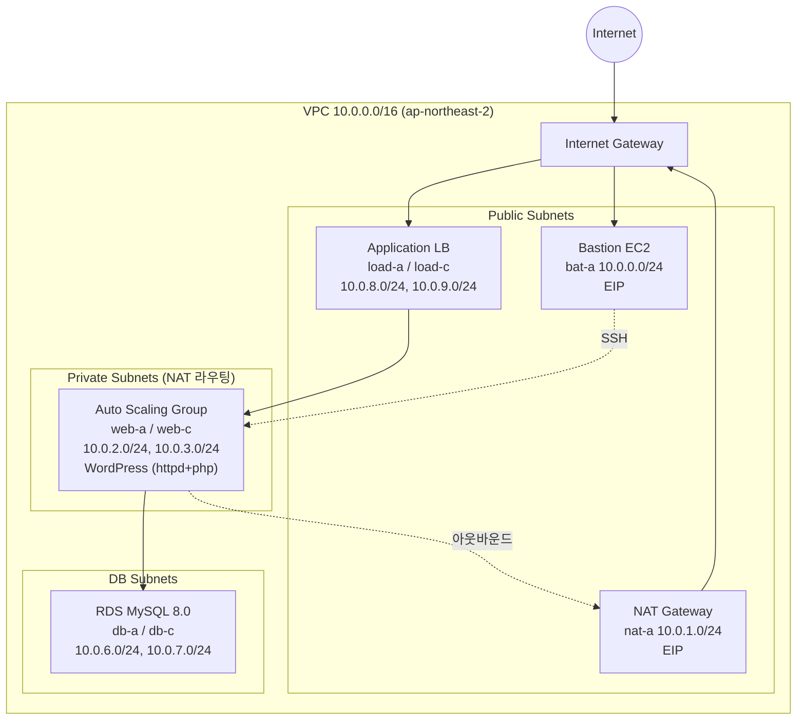

# AWS 3-Tier Architecture with Terraform

Terraform으로 AWS 위에 3-Tier 웹 아키텍처(Bastion / Web(ASG+ALB) / DB(RDS))를 구축하는 IaC 실습 프로젝트입니다.
Web 계층은 Launch Template + Auto Scaling Group으로 확장 가능하게 구성하고, Application Load Balancer로 트래픽을 분산합니다. WordPress는 `user_data`(cloud-init)로 자동 설치되며, RDS 엔드포인트는 `templatefile()`로 동적 주입됩니다.

## Architecture



## 리소스 구성

| 파일 | 리소스 | 설명 |
|---|---|---|
| `00_init.tf` | provider | AWS Provider ~> 6.51, `ap-northeast-2` |
| `01_vpc.tf` | `aws_vpc` | 10.0.0.0/16 |
| `02_ig.tf` | `aws_internet_gateway` | 인터넷 게이트웨이 |
| `03_sub.tf` | `aws_subnet` ×10 | bastion / nat / web / was / db / lb 서브넷 |
| `04~05` | 라우트 테이블 + 연결 | IGW 라우팅 (Public 서브넷) |
| `06_eip.tf` | `aws_eip` ×2 | Bastion, NAT GW용 고정 IP |
| `07~09` | NAT GW + 라우팅 | Private(web) 서브넷의 아웃바운드 경로 |
| `10_key.tf` | `aws_key_pair` | SSH 키 등록 (경로 변수화) |
| `11_sg.tf` | `aws_security_group` | SSH(22), HTTP(80), MySQL(3306, VPC 내부), ICMP |
| `12_ec2.tf` | `aws_instance` ×2 | Bastion + Web 원본 인스턴스 (`templatefile`로 WordPress 설치) |
| `13~15` | ALB Target Group / LB / Listener | HTTP:80, Health check `/index.html` |
| `16_ami.tf` | `aws_ami_from_instance` | Web 인스턴스를 AMI로 캡처 |
| `17_lantem.tf` | `aws_launch_template` | 위 AMI 기반 시작 템플릿 |
| `18~19` | ASG + Target Group 연결 | desired 2 / min 1 / max 6 |
| `20_db.tf` | `aws_db_instance` | RDS MySQL 8.0 (Multi-AZ 서브넷 그룹) |
| `99_out.tf` | outputs | Bastion IP, NAT IP, ALB DNS |

## 사용 방법

```bash
# 1. 변수 파일 생성
cp terraform.tfvars.example terraform.tfvars
# terraform.tfvars에서 db_password, ssh_public_key_path 수정

# 2. 배포
terraform init
terraform plan
terraform apply

# 3. 확인
terraform output load_dns   # ALB DNS로 접속하여 WordPress 확인

# 4. 정리 (과금 방지)
terraform destroy
```

## 트러블슈팅 기록

실습 중 실제로 겪은 오류들:

**1. Health check path 오류**
```
Error: expected health_check.0.path to have prefix /, got indec.html
```
→ `path = "indec.html"` 오타. Health check 경로는 반드시 `/`로 시작해야 함 → `path = "/index.html"`

**2. subnets 속성 타입 오류**
```
Inappropriate value for attribute "subnets": element 0: string required, but have object.
```
→ `aws_lb`의 `subnets`에 서브넷 객체 전체가 아닌 `.id`(문자열)를 전달해야 함
```hcl
subnets = [aws_subnet.load_a.id, aws_subnet.load_c.id]
```

**3. Public IP / user_data 실행 조건 (수업 정리)**

| 인스턴스 네트워크 설정 | Public IP | user_data 실행 |
|---|---|---|
| 명시적 외부(공인) 설정 O | 미부여 | 성공 |
| 명시적 설정 없음 (Public 서브넷) | 부여 | 실패 |
| 명시적 설정 없음 + NAT GW 라우팅 서브넷 | 미부여 | 성공 |

핵심: `user_data` 스크립트가 외부 패키지(dnf, wget)를 받아야 하므로, **인스턴스에 아웃바운드 인터넷 경로가 있어야 부팅 스크립트가 정상 실행**된다. Private 서브넷의 웹 인스턴스는 NAT Gateway를 통해 아웃바운드가 가능하므로 `depends_on`으로 NAT 라우팅 연결이 먼저 완료되도록 보장했다 (`12_ec2.tf`).

## 보안 관련 개선 사항 (원본 실습 대비)

- DB 비밀번호를 코드에서 제거하고 `sensitive` 변수로 분리 (`terraform.tfvars`는 gitignore 처리)
- RDS 엔드포인트 하드코딩 제거 → `templatefile()`로 `aws_db_instance.brkim_db.address` 동적 주입
- SSH 공개키 경로 변수화 (로컬 절대경로 제거)
- `.gitignore`로 tfstate / `.terraform/` 제외 (state 파일에는 DB 비밀번호 등 민감 정보가 평문 저장됨)

### 추가 개선 여지 (실무 기준)

- SG를 계층별로 분리 (현재는 단일 SG 공유 — ALB/Web/DB 각각 최소 권한으로)
- SSH 22번 포트 `0.0.0.0/0` 개방 → Bastion IP 또는 SSM Session Manager로 제한
- RDS `username = root` 대신 별도 관리자 계정 + Secrets Manager 연동
- Remote state backend (S3 + DynamoDB lock)

## 환경

- Terraform (AWS Provider ~> 6.51)
- Region: `ap-northeast-2` (Seoul)
- OS: Amazon Linux 2023 (AMI `ami-08c766d1a55d29288`)
