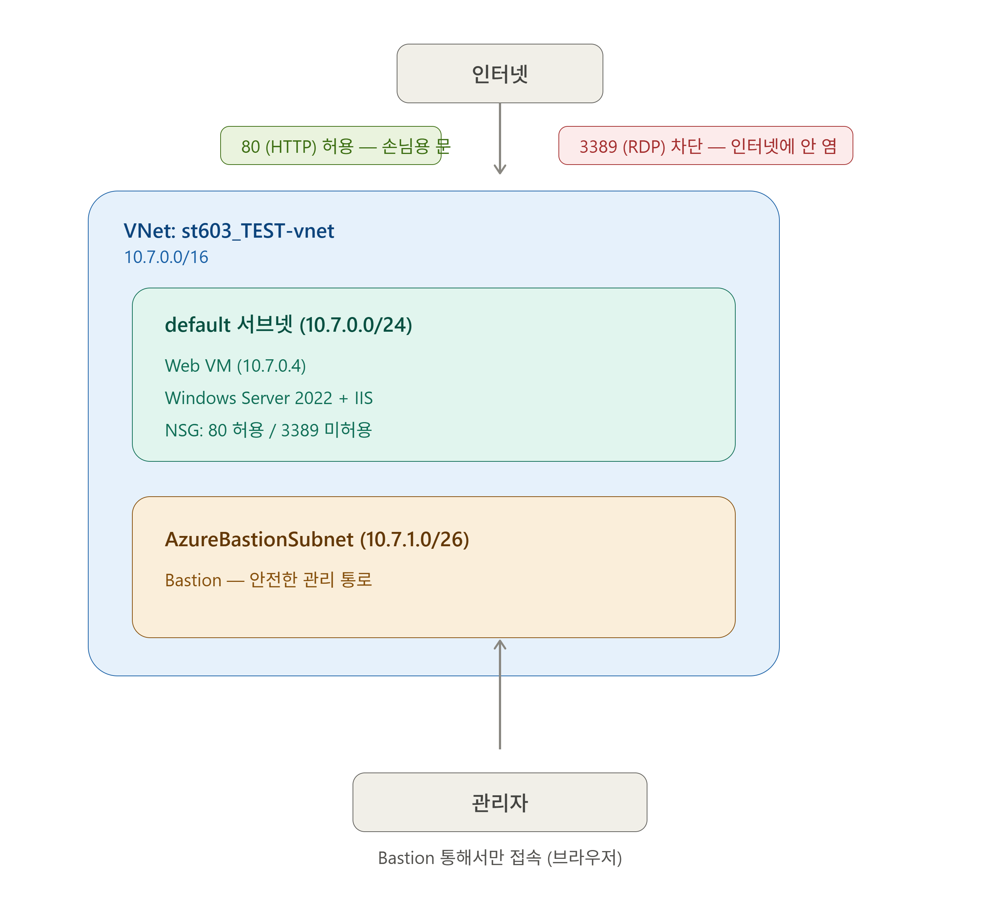
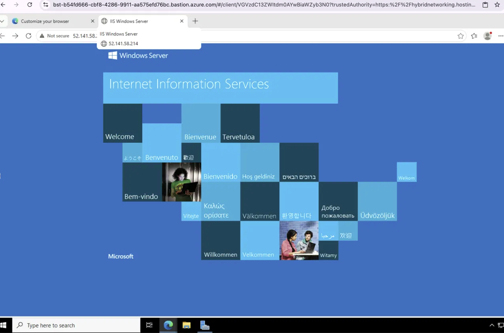
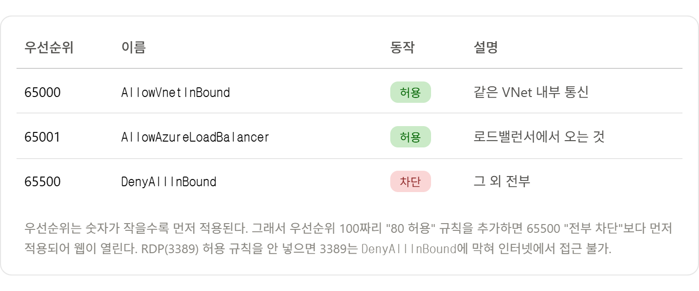

# Azure Bastion으로 RDP 노출 없이 웹서버 VM 구성하기

> **학습 기록** | 2026.07.06 | AZ-700 대비 실습
목표: *인터넷에서 웹(80)은 열되, 관리 통로(RDP 3389)는 인터넷에 노출하지 않고 Bastion으로만 접근한다.*
> 

---

## 왜 이 실습을 했나 (한 줄 요약)

작년부터 이어진 개인정보 유출 사고의 흔한 원인은 **관리 통로(RDP 등)가 인터넷에 노출**되어 무차별 로그인 공격으로 뚫린 것. 이 실습은 그걸 막는 실제 구조를 직접 구성해 본 것.

핵심 보안 원리: **서비스 포트는 열되, 관리 포트는 인터넷에 노출하지 않는다 (공격 표면 최소화).**

---

## 최종 구성도



```
인터넷
  │
  │  80 (HTTP) 허용 ✅  ── 손님용 문
  │  3389 (RDP) 차단 ❌ ── 관리자용 뒷문 (인터넷에 안 염)
  ▼
┌─────────────────────────────────────────┐
│  VNet: st603_TEST-vnet (10.7.0.0/16)    │
│                                         │
│  ┌── default 서브넷 (10.7.0.0/24) ──┐    │
│  │   Web VM (10.7.0.4)              │    │
│  │   - Windows Server 2022 + IIS    │    │
│  │   - NSG: 80 허용 / 3389 미허용    │    │
│  └──────────────────────────────────┘    │
│                                          │
│  ┌── AzureBastionSubnet (10.7.1.0/26) ┐  │
│  │   Bastion (안전한 관리 통로)        │  │
│  └────────────────────────────────────┘  │
└─────────────────────────────────────────┘
        ▲
        │ 관리자는 Bastion 통해서만 접속 (브라우저)
      관리자
```

---

## 구축 순서 (6단계)

### 1. VNet + 서브넷 생성

- VNet 주소 공간: `10.7.0.0/16` (약 65,536개)
- 웹 서브넷: `default` = `10.7.0.0/24` (256개, Azure가 5개 예약 → 251개 사용 가능)
- **트러블**: 공용 학습 계정이라 `10.0.x.x`, `10.1.x.x`가 이미 다른 사람이 사용 중 → 주소 겹침 경고 발생. `10.7.x.x`로 변경해 해결.
- **배운 점**: VNet끼리 주소가 겹치면 피어링 불가. 그래서 실무는 IP 주소 계획(IP address plan)을 미리 세운다.

### 2. VM(웹서버) 배포

- 이미지: Windows Server 2022 Datacenter / 크기: Standard B2ats v2
- 인바운드 포트: **없음** (아무 포트도 인터넷에 열지 않은 상태로 시작)
- **트러블**: 네트워킹 탭을 확인하지 않고 배포 → Azure가 새 VNet을 자동 생성해버림. VM은 만든 뒤 VNet 변경 불가라 삭제 후 재배포.
- **배운 점**: VM 만들 때 네트워킹 탭에서 기존 VNet/서브넷을 반드시 명시 선택해야 함.

### 3. Bastion 생성 (안전한 관리 통로)

- 전용 서브넷 필요: 이름은 정확히 `AzureBastionSubnet`, 크기 `/26` 이상
- 주소: `10.7.1.0/26` (웹 서브넷 `10.7.0.x`와 겹치지 않게)
- **트러블**: Bastion과 서브넷을 동시에 만들려다 참조 오류(`InvalidResourceReference`) → 서브넷을 먼저 만들고, 그 다음 Bastion 생성해 해결.
- **배운 점**: 리소스 참조 순서. 참조 대상(서브넷)이 먼저 존재해야 함.

### 4. Bastion으로 VM 접속

- VM → 연결 → **Bastion으로 이동** 경로로 접속 (브라우저 안에서 원격 데스크톱)
- **트러블**: 첫 로그인 실패 → VM에서 비밀번호 재설정(암호 초기화) 후 성공. 접속은 반드시 “Bastion으로 이동” 정식 경로 사용.
- **핵심**: RDP(3389)를 인터넷에 열지 않았는데도 접속 성공 → Bastion의 존재 이유 확인.

### 5. VM 안에서 웹서버(IIS) 설치

- 서버 관리자 → 역할 및 기능 추가 → **Web Server (IIS)** 선택 → 설치
- 설치 후 IIS는 기본 환영 페이지를 80번 포트로 자동 서비스

### 6. NSG에서 웹 포트(80) 열기 + 확인

- NSG 인바운드 규칙 추가: 소스 `Any` / 대상 포트 `80` / 프로토콜 `TCP` / 작업 `허용` / 우선순위 `100`
- **RDP(3389)는 추가하지 않음** ← 이게 핵심
- 확인: 브라우저에서 `http://<공용IP>` 접속 → IIS 환영 페이지 정상 표시 ✅



---

## NSG 규칙 이해 (핵심 개념)

Azure 기본 인바운드 규칙:



- 우선순위는 **숫자가 작을수록 먼저 적용**됨.
- 그래서 `100`짜리 “80 허용”이 `65500` “전부 차단”보다 먼저 적용되어 웹이 열림.
- RDP 허용 규칙을 안 넣으면 → 3389는 `DenyAllInBound`에 막혀 인터넷에서 접근 불가.

**소스(Source) 판단 = 그 포트가 손님용이냐 관리자용이냐**
- 웹(80): 손님용 → 소스 `Any` (누구나 접속)
- 관리(RDP): 관리자용 → 절대 `Any` 금지. 특정 IP만 허용하거나 아예 열지 않음(Bastion 사용)

---

## 오늘 정리한 개념들

### CIDR (서브넷 크기)

- 슬래시 뒤 숫자 = 앞에서부터 고정하는 비트 길이. 숫자 클수록 범위 작아짐.
- 개수 = 2^(32 − 슬래시숫자). `/24`=256, `/16`=65,536, `/8`≈1,678만
- `/24` 이후 반토막: `/25`=128, `/26`=64, `/27`=32
- 사설 대역: `10.x` / `172.16~31.x` / `192.168.x` 안에서만 사용
- **주의**: `10.0.1.0/16`은 `/16`이 뒤 두 칸을 무시하므로 `10.0.0.0/16`과 같은 범위 → 겹침

### VNet vs 서브넷

- VNet = 큰 울타리(건물). 서브넷 여러 개 담고 확장 여유 위해 크게(/16) 잡음
- 서브넷 = 역할별 구획(층). 각 구획마다 다른 보안 규칙 적용 → “DB만 숨기기” 가능
- /16의 6만 개는 “실제 사용량”이 아니라 “수용 여유”. 대부분 회사는 다 안 씀

### VM

- VM = 데이터센터에서 빌린 “서버 컴퓨터 한 대” (개인 PC 아님, 서비스를 24시간 돌림)
- VM 하나 생성 시 함께 생기는 리소스: 본체 + 디스크 + NIC(랜카드) + 공용IP + NSG

### 이미지 vs OS

- OS = 운영체제 하나 / 이미지 = OS + 프로그램 + 설정까지 “완성 상태를 통째로 찍은 복사본”
- 사진처럼 찍어서 그대로 복제 → 대량 배포에 유리

### HTTP vs HTTPS

- HTTP(80): 암호화 안 됨. 브라우저에 “Not secure” 표시. 테스트/내부용
- HTTPS(443): 암호화. SSL 인증서 필요. 실제 서비스는 필수 (개인정보 보호)

### 가용성/이중화

- 가용성 집합 < 가용성 영역 < 리전 분리(재해복구, DR) 순으로 흩는 범위가 넓어짐
- 실제 서비스는 한 대로 안 두고 흩어서 배치 (한 대 죽어도 서비스 유지)

---

## 시험(AZ-700) 관점 메모

- 시험은 객관식 + 드래그앤드롭 + 핫 에어리어 + 케이스 스터디 혼합, 일부 회차엔 실제 포탈 랩 출제
- 대부분 “만들기”보다 **“상황 읽고 어떤 구성이 맞는지 판단하기”** → “왜 이 리소스를 쓰는지” 이해가 핵심
- **라우팅 도메인이 25~30%로 비중 최대**이자 가장 어려움 (UDR, NAT Gateway, Load Balancer) → 다음 학습 대상
- 주소 겹침 → 피어링 불가 → 대역 변경, 이 패턴 자주 출제 (이번에 직접 경험함)

---

## 다음에 확장하면 (포폴 프로젝트로 키우기)

이 기본 구성에 아래를 얹으면 “3-tier 보안 아키텍처”로 발전 가능:
- [ ] DB 서브넷 분리 (인터넷 차단, 웹 서브넷에서만 접근 허용)
- [ ] Load Balancer + VM 여러 대 이중화
- [ ] 가용성 영역 적용
- [ ] HTTPS(443) + SSL 인증서 적용 → “Not secure” 해결
- [ ] 라우팅(UDR) + Azure Firewall (Hub-Spoke 구조)

---

## 마무리 정리 체크리스트

실습 후 리소스 정리 (크레딧 절약):
- [ ] 리소스 그룹 `st603_TEST`가 개인 전용이면 → 그룹째 삭제
- [ ] 공용 계정이라 다른 사람 것이 섞여 있으면 → 내가 만든 것만 삭제 (VM, Bastion, VNet, NSG, 공용IP, 디스크)
- [ ] 특히 Bastion은 비용이 크므로 반드시 삭제 확인

> ⚠️ 보안 습관 메모: 비밀번호를 채팅/문서에 평문으로 남기지 않기. `Password1234!!` 류의 단순 비밀번호는 실무 금지 (공격자가 가장 먼저 시도하는 패턴).
>