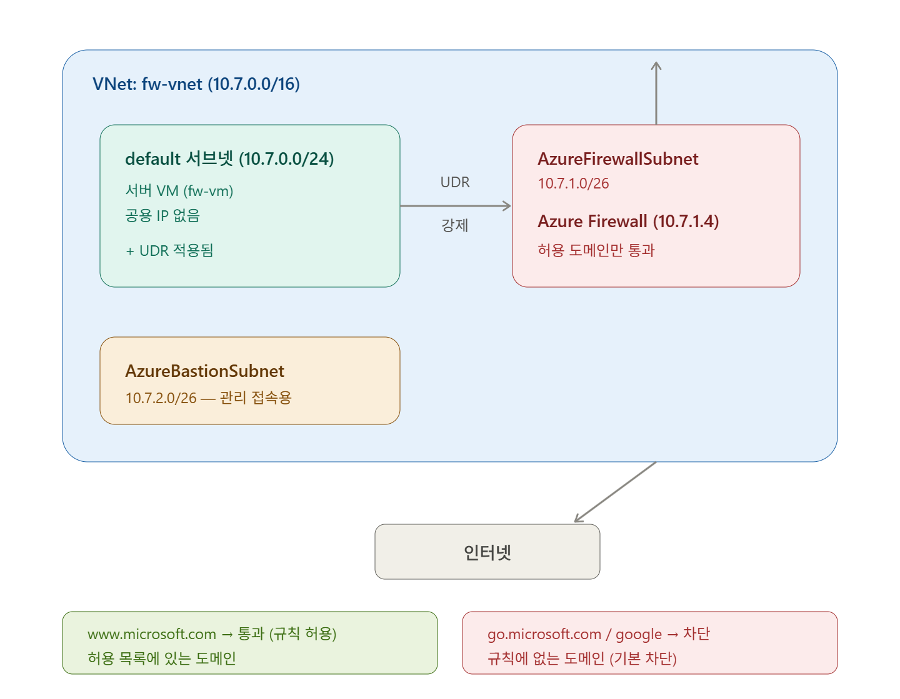
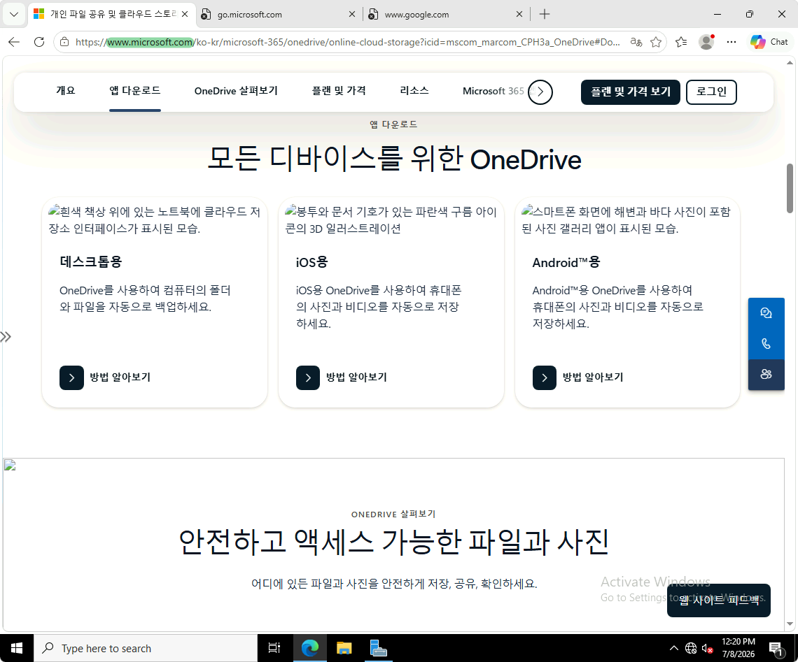
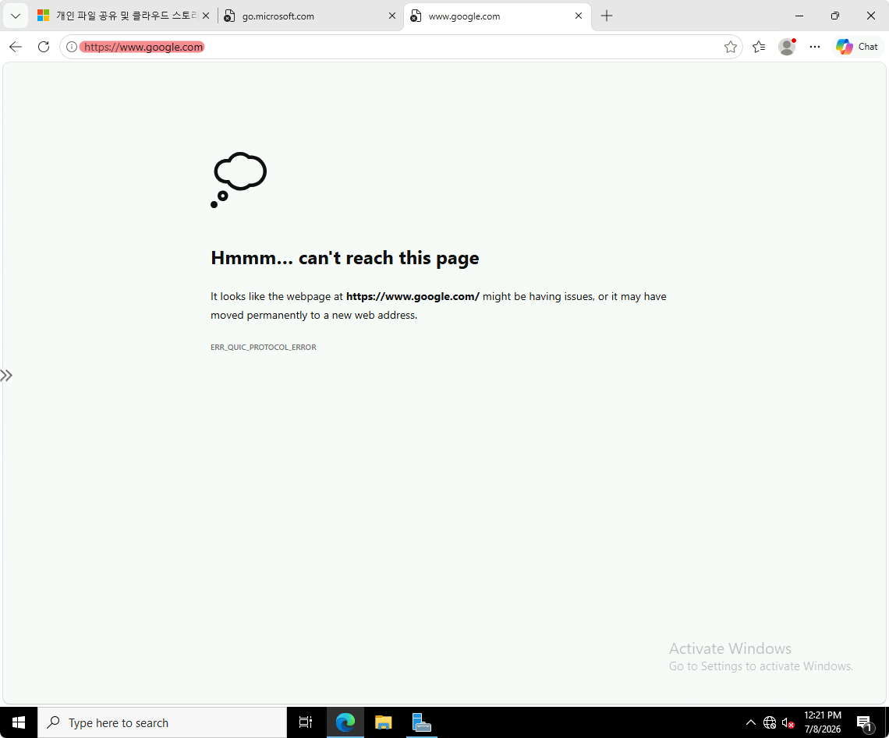
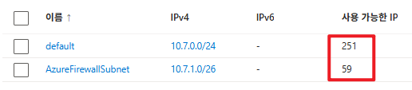

# Azure Firewall + UDR로 아웃바운드 트래픽 통제하기

> **학습 기록** | AZ-700 대비 실습 (2일차)
목표: *서버가 인터넷으로 나갈 때 반드시 방화벽을 거치게 하고(UDR), 방화벽이 허용된 도메인만 통과시킨다.*
1일차(들어오는 트래픽 통제)에 이은 **나가는 트래픽(아웃바운드) 통제** 실습.
> 

---

## 왜 이 실습을 했나 (한 줄 요약)

서버가 악성코드에 감염되어 외부로 데이터를 몰래 빼내려 해도(개인정보 유출), 모든 트래픽이 방화벽을 거치게 되어 있으면 허용 안 된 목적지는 차단된다. **나가는 트래픽까지 통제하는 것**이 이 실습의 핵심.

핵심 원리: 라우팅(UDR)으로 경로를 강제하고, 방화벽으로 검사·차단·기록한다.

---

## 최종 구성



```
                VNet: fw-vnet (10.7.0.0/16)
 ┌──────────────────────────────────────────────────┐
 │                                                  │
 │  default 서브넷 (10.7.0.0/24)                    │
 │  ┌────────────────────┐    UDR     ┌─────────────┐ │
 │  │ 서버 VM (fw-vm)    │  ───강제──▶│ 방화벽      │ │
 │  │ 공용 IP 없음       │            │ 10.7.1.4    │ │──▶ 인터넷
 │  │ + UDR 적용         │            │ (허용만 통과) │ │
 │  └────────────────────┘            └─────────────┘ │
 │                              AzureFirewallSubnet   │
 │  AzureBastionSubnet (10.7.2.0/26)  (10.7.1.0/26)   │
 │  └ 관리 접속용 Bastion                             │
 └──────────────────────────────────────────────────┘

  결과:
   www.microsoft.com  → 통과 ✅ (규칙에 허용됨)
   go.microsoft.com   → 차단 ❌ (규칙에 없음)
   www.google.com     → 차단 ❌ (규칙에 없음)
```

---

## 구축 순서 (5단계)

### 1. VNet + 서브넷 3개

- VNet: `fw-vnet` (`10.7.0.0/16`)
- 서버용: `default` (`10.7.0.0/24`)
- 방화벽 전용: `AzureFirewallSubnet` (`10.7.1.0/26`) — 이름 고정, /26 이상
- 관리 접속용: `AzureBastionSubnet` (`10.7.2.0/26`)
- 세 서브넷이 각각 `10.7.0.x` / `10.7.1.x` / `10.7.2.x`로 안 겹침

### 2. VM(서버) 배포

- Windows Server 2022 / `default` 서브넷에 배치
- **공용 IP 없음** ← 방화벽 통해서만 인터넷 접근하게 하려고
- **트러블**: VM을 `AzureFirewallSubnet`에 넣으려다 “restricted” 에러 → 방화벽 전용 서브넷은 VM이 못 들어감. `default`로 변경해 해결.

### 3. Azure Firewall 생성

- SKU: 표준(Standard) / 방화벽 규칙(클래식) 사용
- **가상 네트워크: 기존 항목 사용 → `fw-vnet`** ← “새로 만들기” 누르면 새 VNet 생기니 주의
- 공용 IP 새로 만들기 (방화벽의 인터넷 관문)
- 방화벽 내부 IP: `10.7.1.4`
- **트러블**: “방화벽 관리 NIC 활성화”가 켜져 있어 에러 → 강제 터널링용 고급 기능이라 체크 해제.
- **주의**: 배포에 10~20분 소요, 크레딧 많이 먹음.

### 4. UDR(라우트 테이블) 생성 및 연결

- 라우트 테이블 `fw-route` 생성
- 경로 추가:
    - 대상: `0.0.0.0/0` (모든 인터넷 = 기본 경로)
    - 다음 홉 유형: **가상 어플라이언스**
    - 다음 홉 주소: `10.7.1.4` (방화벽)
- **서버 서브넷(`default`)에만 연결** (방화벽 서브넷엔 연결 안 함)
- 의미: “서버가 인터넷 어디로 가든 무조건 방화벽부터 거쳐라”

### 5. 방화벽 규칙 + 확인

- 애플리케이션 규칙 컬렉션 추가:
    - Source: `10.7.0.0/24` (서버 서브넷)
    - 프로토콜: `http:80, https:443`
    - 대상 FQDN: `www.microsoft.com`
    - 작업: 허용
- **확인 결과**:
    - `www.microsoft.com` → 페이지 뜸 ✅
    - `go.microsoft.com` → 차단 (ERR_CONNECTION_CLOSED) ❌
    - → 방화벽이 아웃바운드를 통제함을 확인
    
    
    



---

## 핵심 개념 정리

### UDR (User Defined Route, 사용자 정의 경로)

- Azure 기본 경로(시스템 라우트)는 서버가 인터넷으로 **바로** 나감
- UDR은 이 경로를 강제로 바꿔 “특정 장비(방화벽)를 거쳐 가라”고 지정
- 비유: 내비 기본 최단경로 vs “톨게이트(방화벽) 반드시 경유” 강제

### 다음 홉 유형 (Next hop type)

| 유형 | 의미 | 우리 실습 |
| --- | --- | --- |
| 가상 어플라이언스 | 방화벽 등 중간 장비로 보냄 | ✅ 사용 |
| 가상 네트워크 게이트웨이 | VPN으로 온프레미스 등으로 | - |
| 가상 네트워크 | 같은 VNet 내부로 | - |
| 인터넷 | 그냥 인터넷으로 (기본 동작) | - |
| 없음 | 트래픽 폐기(차단) | - |

### 0.0.0.0/0 (기본 경로)

- “모든 주소 = 전체 인터넷”을 뜻하는 특수 표기
- “그 외 모든 목적지”를 가리킴. UDR에서 “모든 인터넷 트래픽을 방화벽으로” 할 때 사용

### FQDN 규칙 — 정확히 일치해야 통과 (중요)

- `www.microsoft.com`만 허용하면 `go.microsoft.com`은 차단됨 (앞부분이 달라 다른 도메인)
- microsoft 전체를 허용하려면 `.microsoft.com` (와일드카드) 사용
- 보안 원칙: 너무 넓게 열지 말고 필요한 도메인만 정확히 허용

### 방화벽 규칙 종류

- **애플리케이션 규칙**: 도메인(FQDN) 기준 허용/차단 — 이번에 사용
- **네트워크 규칙**: IP·포트 기준
- **NAT 규칙(DNAT)**: 밖→안으로 들어오는 트래픽 전달
- Azure Firewall 기본값은 “전부 차단(deny all)” → 허용 규칙을 명시해야 통과

### 어플라이언스 / NVA

- NVA = Network Virtual Appliance (네트워크 가상 어플라이언스)
- 방화벽, IDS/IPS, 프록시 등 트래픽 처리 전용 장비
- 트래픽을 이런 장비로 보내려면 다음 홉을 “가상 어플라이언스”로 지정

---

## 1일차 vs 2일차 (인바운드 vs 아웃바운드)

| 구분 | 1일차 | 2일차 (오늘) |
| --- | --- | --- |
| 방향 | 인바운드(들어오는) | 아웃바운드(나가는) |
| 도구 | NSG | UDR + Azure Firewall |
| 내용 | 웹(80) 열고 RDP(3389) 막기 | 허용 도메인만 나가게 |
| 보안 의미 | 관리 통로 노출 안 함 | 데이터 유출 경로 차단 |

---

## 시험(AZ-700) 관점 메모

- **라우팅 도메인은 배점 25~30%로 최대**, 가장 어려운 파트 → 오늘 그 핵심(UDR)을 직접 구성함
- 자주 나오는 패턴: “트래픽을 방화벽/NVA로 보내려면 다음 홉을? → 가상 어플라이언스”
- `0.0.0.0/0` = 기본 경로, FQDN 정확 일치 규칙, 방화벽 기본 deny 등이 출제 포인트

---

## 📝 메모

`/24`는 256개 중 Azure가 5개 예약해서 251개

`/26`은 64개 중 59개만 사용 가능.


